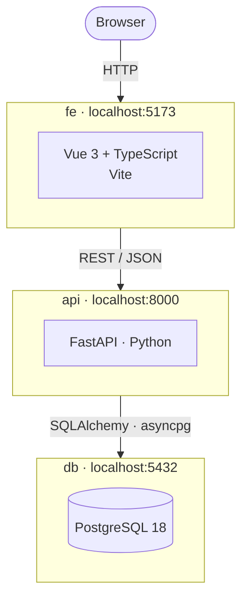

# project_alpha

A FastAPI backend with a Vue 3 + TypeScript frontend and a PostgreSQL database.

- Backend: [`alpha-api/`](alpha-api/README.md)
- Frontend: [`alpha-fe/`](alpha-fe/README.md)

## Overview



---

## Prerequisites

You need two tools installed before you can run this project: **Docker** and **Git**.

### 1. Docker Desktop

Docker runs the database and API inside containers so you don't have to install Postgres or Python manually.

**Mac**

1. Download Docker Desktop for Mac from [docker.com](https://www.docker.com/products/docker-desktop/).
2. Open the `.dmg` file and drag Docker to your Applications folder.
3. Launch Docker from Applications and wait until the status bar in the bottom-left says **"Engine running"**.
4. Confirm it worked:
   ```bash
   docker --version
   ```

**Windows**

Docker on Windows requires WSL 2 (Windows Subsystem for Linux). Follow these steps in order:

1. Open PowerShell **as Administrator** — right-click the PowerShell icon and choose *Run as administrator*.
2. Install WSL 2:
   ```powershell
   wsl --install
   ```
3. Restart your computer when prompted.
4. Download Docker Desktop for Windows from [docker.com](https://www.docker.com/products/docker-desktop/) and run the installer with default settings.
5. Launch Docker Desktop and wait until the status bar in the bottom-left says **"Engine running"**.
6. Open a new PowerShell window and confirm:
   ```powershell
   docker --version
   ```

---

### 2. Git

**Mac** — Git comes pre-installed. Confirm with:
```bash
git --version
```
If it's not installed, run `brew install git`.

**Windows**

1. Download the installer from [git-scm.com](https://git-scm.com/download/win) and run it.
2. On the *Adjusting your PATH environment* screen, select **"Git from the command line and also from 3rd-party software"** (the default).
3. Leave all other options at their defaults and complete the install.
4. Open a new PowerShell window and confirm:
   ```powershell
   git --version
   ```

---

## Setup

### 1. Clone the repository

```bash
git clone <repository-url>
cd project_alpha
```

### 2. Configure environment variables

The database container reads credentials from a `.env` file in the project root.

**Mac:**
```bash
cp .env.example .env
```

**Windows:**
```powershell
copy .env.example .env
```

Open `.env` and fill in values for `POSTGRES_USER`, `POSTGRES_PASSWORD`, and `POSTGRES_DB`.

### 3. Start the stack

Make sure Docker Desktop is open and running, then bring up all services (database, API, and frontend):

```bash
make stack-up
# or: docker compose up -d
```

Source files are mounted into each container, so edits you make locally are picked up automatically — no rebuild required.

| Service | URL |
|---|---|
| Frontend | `http://localhost:5173` |
| API | `http://localhost:8000` |
| API docs | `http://localhost:8000/docs` |
| Database | `localhost:5432` |

---

## Commands

### Full stack

| Task | Command |
|---|---|
| Start all services | `make stack-up` / `docker compose up -d` |
| Stop all services | `make stack-down` / `docker compose down` |
| Tail all logs | `make stack-logs` / `docker compose logs -f` |

### Database only

| Task | Command |
|---|---|
| Start the database | `make db-up` / `docker compose up -d db` |
| Stop the database | `make db-down` / `docker compose down` |
| Stop and delete all data | `make db-clean` / `docker compose down -v` |
| View database logs | `make db-logs` / `docker compose logs -f db` |

> **Warning:** `db-clean` permanently deletes the database volume and all stored data.

---

## Deployment

The project deploys to **Render** using the `render.yaml` Blueprint. The API connects to **Neon Serverless Postgres**.

### 1. Set up Neon

1. Create a project at [neon.tech](https://neon.tech).
2. From the project dashboard, copy the connection string for the `neondb_owner` role. It looks like:
   ```
   postgresql://neondb_owner:<password>@<endpoint>.neon.tech/neondb?sslmode=require
   ```
3. Convert it to the asyncpg format you'll paste into Render (replace `postgresql://` with `postgresql+asyncpg://`):
   ```
   postgresql+asyncpg://neondb_owner:<password>@<endpoint>.neon.tech/neondb?ssl=require
   ```

### 2. Deploy alpha-api (Web Service)

1. Push the repo to GitHub.
2. Go to [render.com](https://render.com) → **New → Web Service**.
3. Connect your GitHub repo.
4. Configure the service:

   | Setting | Value |
   |---|---|
   | Language | Docker |
   | Root Directory | `alpha-api` |
   | Dockerfile Path | `./Dockerfile.prod` |

5. Set environment variables:

   | Key | Value |
   |---|---|
   | `DATABASE_URL` | asyncpg connection string from step 1 |
   | `CORS_ALLOWED_ORIGINS` | *(leave blank for now — fill in after alpha-fe is deployed)* |

6. Click **Deploy**. The API is live at `https://alpha-api.onrender.com`.

### 3. Deploy alpha-fe (Static Site)

1. Go to **New → Static Site** and connect the same repo.
2. Configure the site:

   | Setting | Value |
   |---|---|
   | Root Directory | `alpha-fe` |
   | Build Command | `npm ci && npm run build` |
   | Publish Directory | `dist` |

3. In the service **Settings** tab, scroll to **Redirects/Rewrites** and add a rule:

   | Source | Destination | Action |
   |---|---|---|
   | `/*` | `/index.html` | Rewrite |

4. Set environment variables:

   | Key | Value |
   |---|---|
   | `VITE_API_BASE_URL` | `https://alpha-api.onrender.com` |

5. Click **Deploy**. Once finished, copy the site URL.

### 4. Finish wiring CORS

1. Go back to the **alpha-api** service → **Environment**.
2. Set `CORS_ALLOWED_ORIGINS` to the alpha-fe URL from step 3.
3. Save — Render will redeploy alpha-api automatically.

> Render terminates TLS at the edge — both services are reachable only over HTTPS. HTTP requests to either service are redirected to HTTPS automatically.

---

## API examples

The API runs at `http://localhost:8000`. Interactive Swagger UI is at `http://localhost:8000/docs`.

### Users

**Create a user**
```bash
curl -X POST http://localhost:8000/users/ \
  -H "Content-Type: application/json" \
  -d '{"username": "alice", "password": "secret", "description": "coffee enthusiast"}'
# {"id":1,"username":"alice","description":"coffee enthusiast"}
```

**List all users**
```bash
curl http://localhost:8000/users/
# [{"id":1,"username":"alice","description":"coffee enthusiast"}]
```

**Get a single user**
```bash
curl http://localhost:8000/users/1
```

**Update a user**
```bash
curl -X PUT http://localhost:8000/users/1 \
  -H "Content-Type: application/json" \
  -d '{"username": "alice", "password": "newpass", "description": "updated bio"}'
```

**Delete a user**
```bash
curl -X DELETE http://localhost:8000/users/1
```

---

### Coffee

`intensity` must be 1–10. `rating` must be 1–5. `temperature` is a free-text string (e.g. `"Hot"`, `"Cold"`).

**Log a coffee**
```bash
curl -X POST http://localhost:8000/coffee/ \
  -H "Content-Type: application/json" \
  -d '{
    "type": "Flat White",
    "shop": "Onyx Coffee Lab",
    "location": "Bentonville, AR",
    "intensity": 7,
    "rating": 5,
    "temperature": "Hot",
    "notes": "nutty, sweet finish",
    "userId": 1
  }'
# {"id":1,"type":"Flat White","shop":"Onyx Coffee Lab","location":"Bentonville, AR","intensity":7,"rating":5,"temperature":"Hot","notes":"nutty, sweet finish","userId":1}
```

**List all coffees**
```bash
curl http://localhost:8000/coffee/
```

**Get a single coffee** (includes user info)
```bash
curl http://localhost:8000/coffee/1
```

**Update a coffee**
```bash
curl -X PUT http://localhost:8000/coffee/1 \
  -H "Content-Type: application/json" \
  -d '{
    "type": "Espresso",
    "shop": "Onyx Coffee Lab",
    "location": "Bentonville, AR",
    "intensity": 9,
    "rating": 4,
    "temperature": "Hot",
    "notes": "bold, slightly bitter",
    "userId": 1
  }'
```

**Delete a coffee**
```bash
curl -X DELETE http://localhost:8000/coffee/1
```
